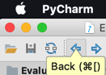
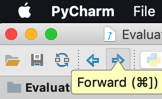

# 常用快捷键

此处整理`PyCharm`中常用的一些快捷键。

## 光标移动：前进/后退(返回)

* 返回=光标返回=移动到 返回到 前一次光标 鼠标 的位置
* 前进=光标前进=移动到 前进到 后一次光标 鼠标 的位置

的快捷键是：

* Mac
  * `Back`=**返回**：`Command + [`
    * 
  * `Forward`=**前进**：`Command + ]`
    * 

## 跳转到**页首**=**文件开始处**=**页面顶部**

PyCharm 文件最开始 页面开始 页面顶部

即 跳转 页首 页面开始

的快捷键：

* Win
  * `Control`＋`Home`/`End`：跳转到文件的**开始**/**末尾**
* Mac
  * `Command`＋`Fn`＋**⬅️左键**／**右键➡️**：跳转到文件的**开始**/**末尾**
    * 说明
      * Mac中此处`Command`对应着Win中的`Control`
      * Mac中没有（直接的）Home/End键，而以实际上是：
        * `Fn`+**⬅️左键**＝`Home`
        * `Fn`＋**右键➡️**＝`End`
