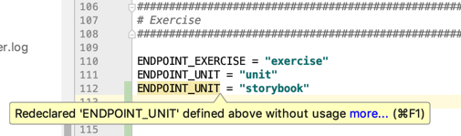
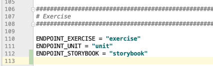
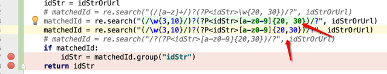
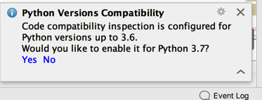
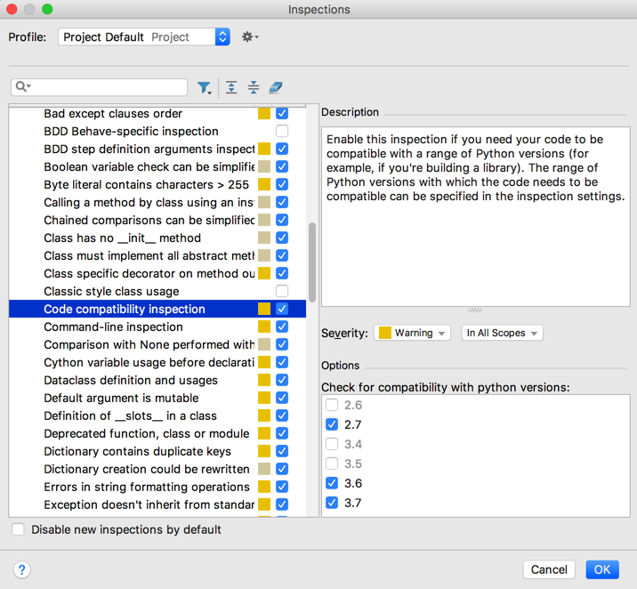
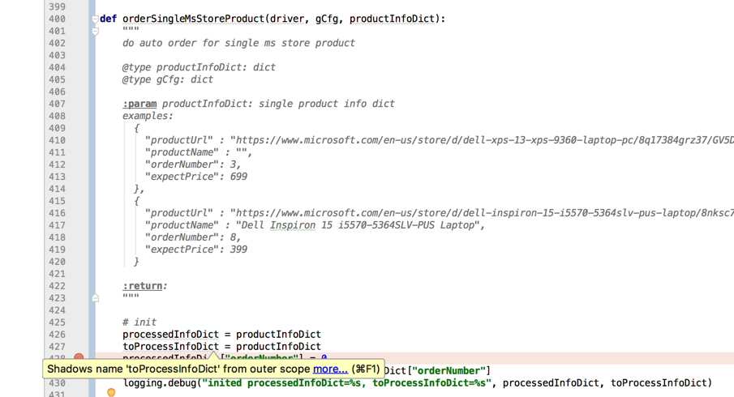

# 编辑期间

PyCharm的智能之处，在静态的代码文件编辑期间，也有很多的体现。

下面举例说明：

## 变量名重复

变量错误提示之`命名重复`

此处拷贝上面一行后，修改了后面的值后，但是忘了及时修改前面的变量名了，然后变量名变黄色警告提示出错了：

`Redeclared xxx defined above without usage`



-》然后及时改为正常的变量名，即可：



-》很是贴心，防止笔误导致变量出错。

## 正则表达式语法错误则显示普通字符串颜色

折腾[【已解决】Python的正则re的search查找不到值](http://www.crifan.com/python_regex_re_search_not_find_value)期间

* 都能检测出Python的`re`的`{m,n}`的格式，从而显示出正确的蓝色数字
  * 而不小心写错成中间有多余空格：`{m, n}`，都会显示出字符串的绿色



真的很智能->从颜色显示上就帮你容易识别出错误的正则的语法。

## Python版本兼容性提示

之前遇到提示：



点击`Yes`



## 变量提示：`Shadows name from outer scope`

之前遇到代码

```python
def xxx():
  for (curIdx, eachProductDict) in enumerate(curLoopProductList):
      logging.info("[%s] eachProductDict=%s", curIdx, eachProductDict)
      (processedInfoDict, toProcessInfoDict) = orderSingleMsStoreProduct(driver, gCfg, eachProductDict)
      processedOrderTime = processedInfoDict["orderNumber"]
      ...
```

出现提示：

```bash
Shadows name from outer scope
This inspection detects shadowing names defined in outer scopes
```



具体含义是：

函数内部的变量，如果和函数被调用的外部的变量一样的话，就被`PyCharm`中叫做`shadows name`

这样的话，容易引发不容易觉察到的，由于函数内部和外部的变量名一致而引发的一些问题：

比如：内部函数名引用时不小心写错了时，就会导致其实调用了外部变量名，从而导致逻辑错乱。

所以解决办法是：

确保函数内部和外部的变量名不要重复，这样就不会导致可能由此导致的错误了。

后来代码做了改动：

在外部也有的一个全局变量`processedInfoDict`的情况下，把函数内部的`processedInfoDict`变量改名，比如改为`hasProcessedInfoDict`：

```python
processedInfoDict = {"xxx": "yyy"}

def xxx():
  for (curIdx, eachProductDict) in enumerate(curLoopProductList):
      logging.info("[%s] eachProductDict=%s", curIdx, eachProductDict)
      (hasProcessedInfoDict, needToProcessInfoDict) = orderSingleMsStoreProduct(driver, gCfg, eachProductDict)
      processedOrderTime = hasProcessedInfoDict["orderNumber"]
      ...
```

就可以了消除警告了。
