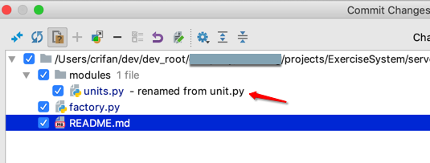
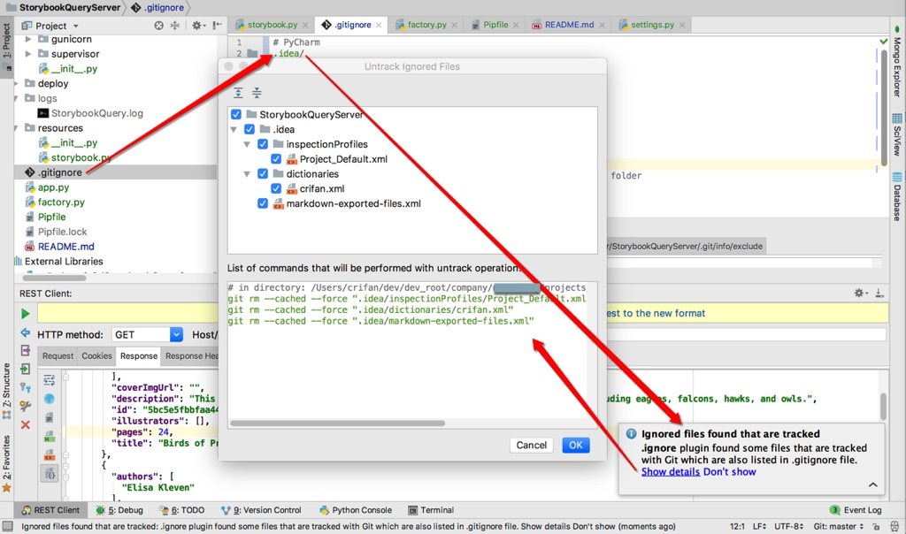
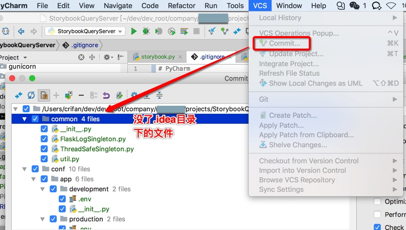
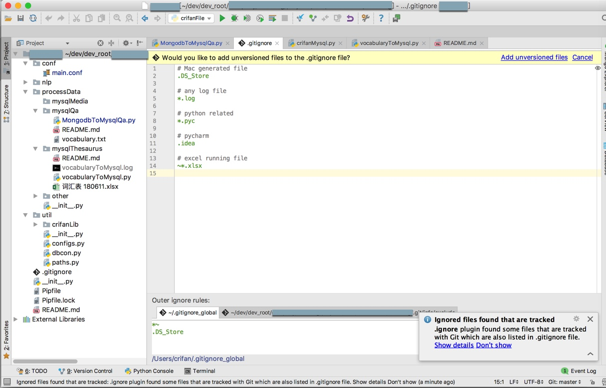
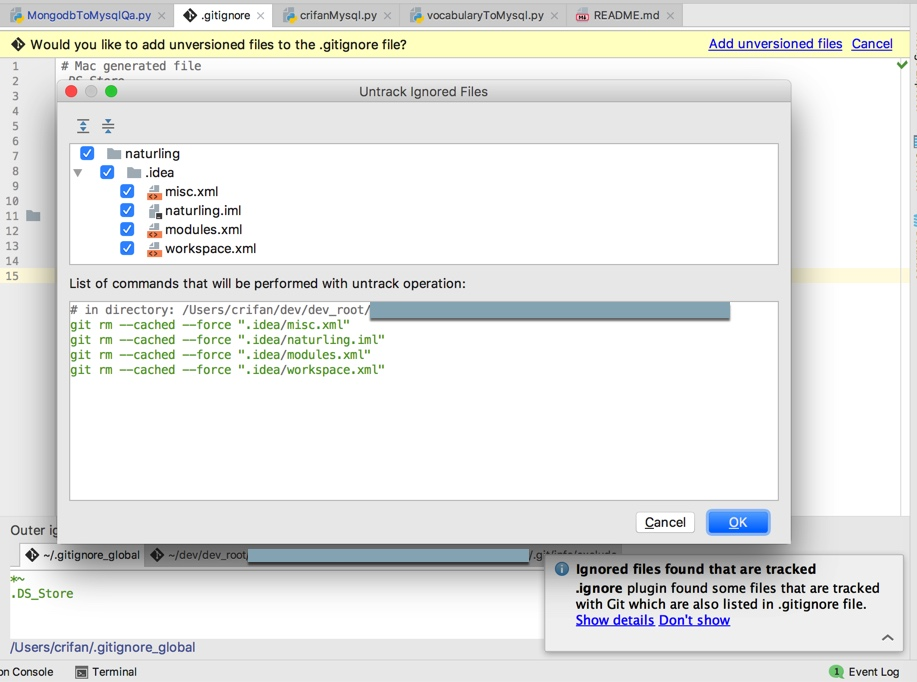

# git支持

PyCharm对于代码版本管理工具：`git`

支持的也很好。有很多细节功能值得一提，体现了智能之处：

## 文件名改动提示

git提交代码时，文件名改动都可以检测出来并提示你：

某次把`unit.py`改为了`units.py`，然后commit提交代码之前，就可以看到对应提示：



很是人性化。

## 检测出.gitignore排除的文件残留在git记录的项目中

当去编辑`.gitignore`，加上`.idea/`后，目的是，排除和项目代码无关的PyCharm的一些配置文件

此时，`PyCharm`会检测到此改动，并且提示你：

`.gitignore中发现排除了一些文件`

但是却（由于之前没排除，而加入）存在项目中

所以会问你如何操作

点击查看详情

此时，会自动列出代码：

```bash
# in directory: /Users/crifan/dev/dev_root/xxx/StorybookQueryServer
git rm --cached --force ".idea/inspectionProfiles/Project_Default.xml"
git rm --cached --force ".idea/dictionaries/crifan.xml"
git rm --cached --force ".idea/markdown-exported-files.xml"
```

你点击OK后，即可从git本地缓存中删除这些之前误操作保存到git中的文件



然后再去commit提交时：



即可发现，已经去除掉了刚才还存在的`.idea`文件夹中的那些文件

-》由此自动帮你检测出问题，还给出问题的解决方案的IDE，才叫真的智能。

## 对于`.gitignore`的智能支持

安装了`.ignore`插件后，自动检测出并提示：

`Would you like to add unversioned files to the .gitignore file?`

意思是：虽然有些文件之前被放到了.gitignore中，但是却也被加入到了git中了：



点击`Add unversioned files`，弹框`Untrack Ignored Files`：



```git
# in directory: /Users/crifan/dev/dev_root/xxx
git rm --cached --force ".idea/misc.xml"
git rm --cached --force ".idea/naturling.iml"
git rm --cached --force ".idea/modules.xml"
git rm --cached --force ".idea/workspace.xml"
```

意思是：之前已经把PyCharm的项目配置`.idea`目录加到git管理中了，但是此处`.gitignore`中却又排除管理了：

```git
# pycharm
.idea/
```

所以有点自相矛盾了。

而此处的处理是：
继续把`.idea/`加入到项目管理中。

而把`.gitignore`中改为：

```git
# pycharm
#.idea/
```

即可。
