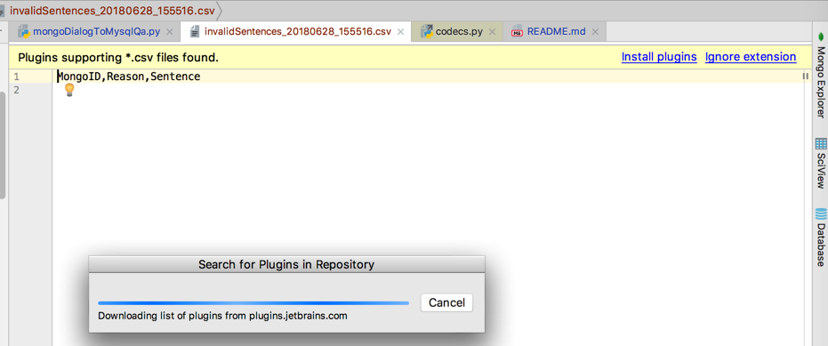
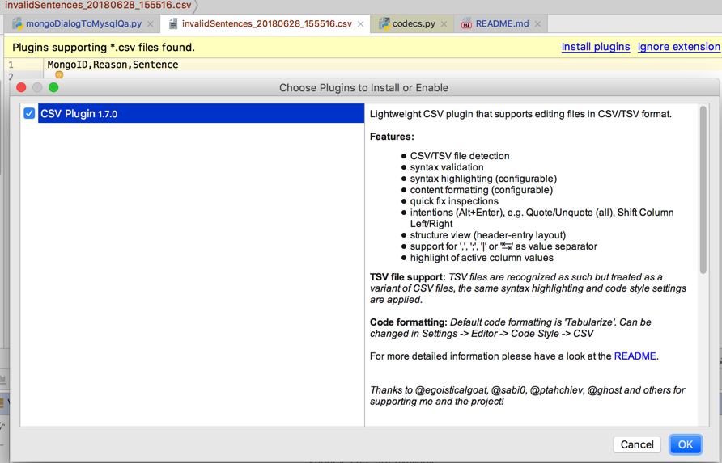
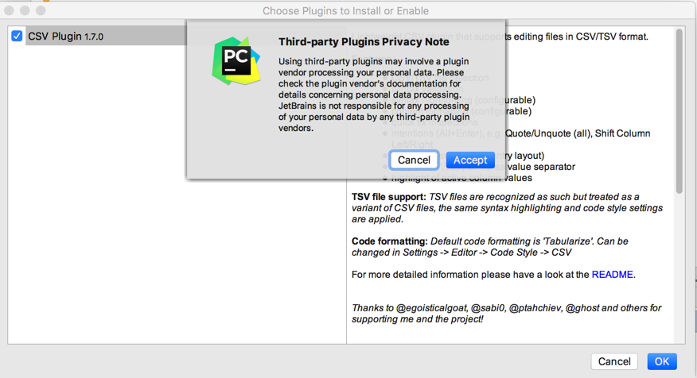
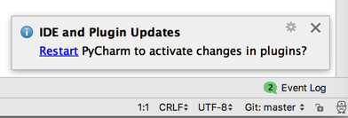
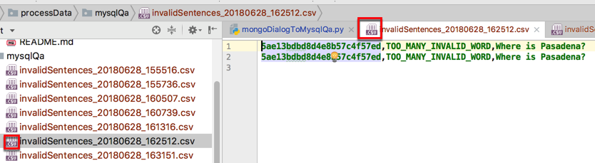
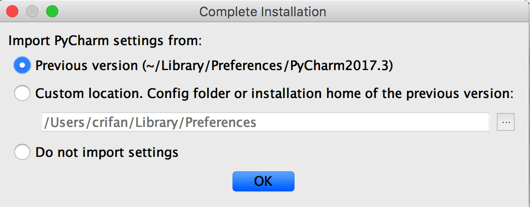

# 作为IDE本身

PyCharm做为一个IDE本身，功能方面也做的很好了。下面举例说明。

## 自动识别文件类型并提示安装相关插件

和之前总结的[VSCode](https://book.crifan.com/books/best_editor_vscode/website/)中一样：

当打开不认识的类型的文件（应该是通过后缀名推测的）

然后就会提示安装对应插件，以便于更好的显示（比如代码高亮）：

根据提示去安装`csv`文件的插件`CSV Plugin`：

此处是第三方的插件（不是PyCharm官方的），所以会弹框提示`Third-party Plugins Privacy Note`：

点击`Accept`即可。

插件安装完毕后会提示你重启：

点击`Restart`重启后，项目列表中文件有了新的图标，且文件内容可以代码高亮：

## 支持导致之前版本的配置

版本升级后，智能监测到之前版本，并导入之前的配置：

