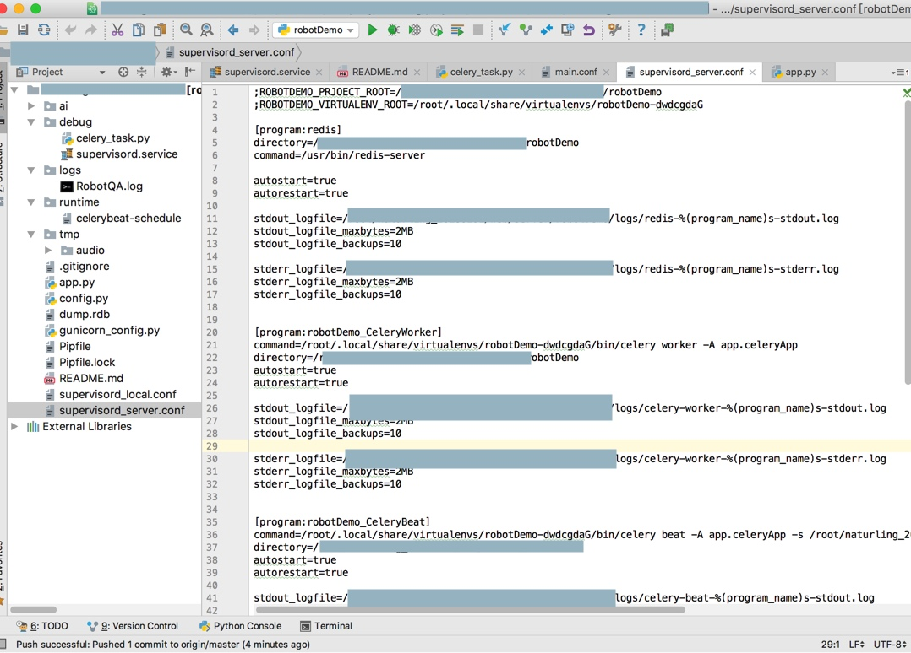
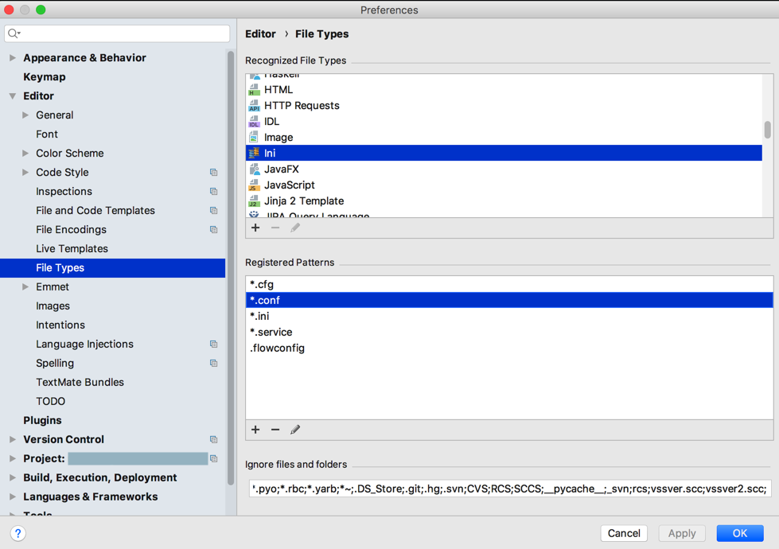
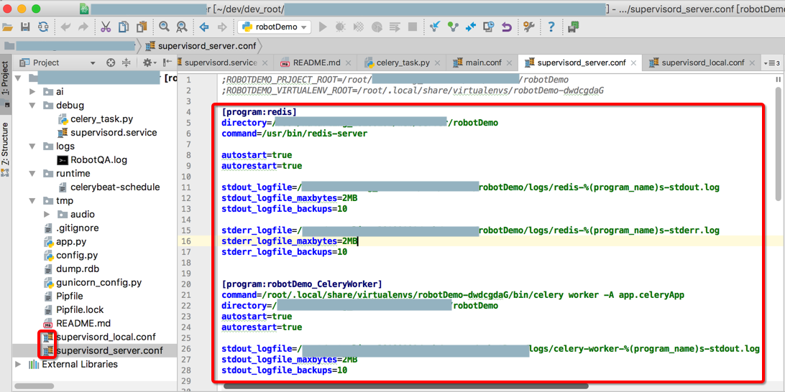

# 问题和心得

## 已知问题

PyCharm也有一些小问题。整理如下：

### log文件的语法高亮

记得，之前默认就已支持log日志文件的语法高亮显示的。

但是后来不知道何时何故log文件失去语法高了

去折腾过

[【未解决】PyCharm中添加log文件支持语法高亮显示](http://www.crifan.com/pycharm_add_log_file_syntax_highlight)

但是并没有解决。

抽空再去找原因。

### 偶尔会一直indexing重建索引

PyCharm偶尔会有个bug：

一直处于indexing，且CPU占用率很高

解决办法：

`File`->`Invalidate Caches/Restart`->重启PyCharm

一般均可解决。如果还不行，再多试试几次。

详见：[【已解决】PyCharm一直在重新indexing建立索引](https://www.crifan.com/pycharm_always_rebuild_indexing_recreate_index/)

### 不支持在Markdown中粘贴图片

PyCharm中在Markdown中，不支持粘贴图片：

 [【未解决】PyCharm中markdown编辑器支持粘贴图片](http://www.crifan.com/pycharm_markdown_editor_support_paste_image)

其实这个问题，严格意思上不算是PyCharm的问题，而是属于Markdown的插件的问题。

但是与之对比，[VSCode](https://book.crifan.com/books/best_editor_vscode/website/)中支持Markdown中粘贴图片，很是好用：

[Paste Image · 史上最好用的编辑器：VSCode](https://book.crifan.com/books/best_editor_vscode/website/plugin/common_plugins/paste_image.html)

[【已解决】VSCode中插件Paste Image的粘贴图片快捷键Command+Alt+V失效 – 在路上](https://www.crifan.com/vscode_plugin_paste_image_shortcut_command_alt_v_not_work/)

## PyCharm心得

此处整理一些使用PyCharm的经验和心得。

### 更改文件类型使其语法高亮

macOS中`conf`文件之前被识别为`Text`，没有语法高亮：

想要改为`ini`格式，以便于文件内容可以被语法高亮。

具体步骤：

`PyCharm`->`Preferences`->`Editor`->`File Types for macOS`

然后删除`Text`中的`*.conf`

再给`ini`格式加上`*.conf`

即可使得此处的`conf`文件，语法高亮显示了：

