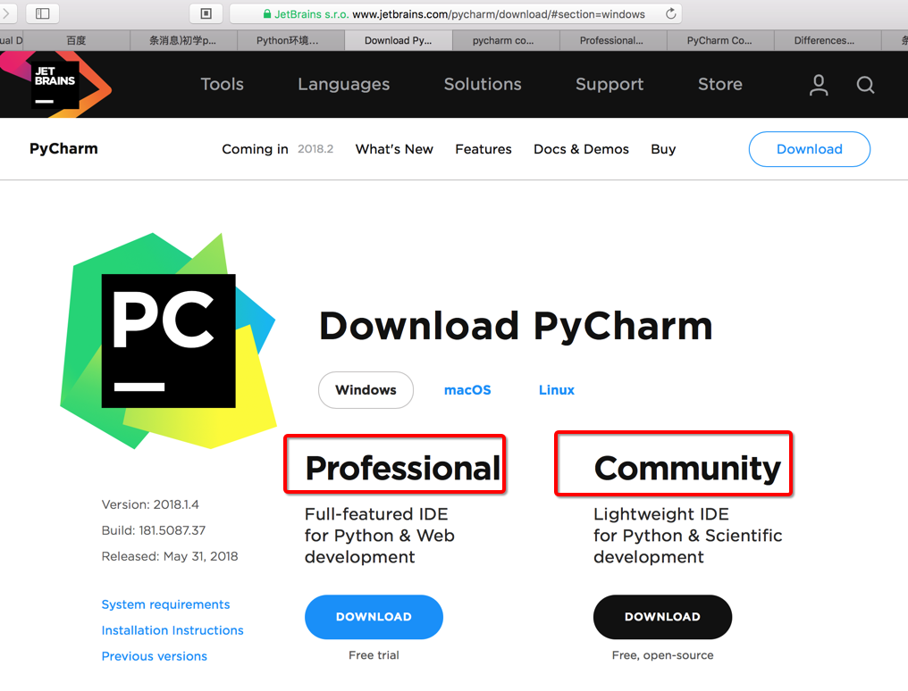

# 选择PyCharm版本

PyCharm有2个版本，关于如何选择，现在整理如下：

[官网](https://www.jetbrains.com/pycharm/download/)截图：

* 概述
  * `Community`=**社区版**=**免费版**
    * 轻量级，用于Python和科学计算的开发
      * Lightweight IDE for Python & Scientific development
    * 说明：虽然号称功能少一点，但是对于多数人，尤其是普通开发人员，影响不大，足够用了
  * `Professional`=**专业版**=**收费版**
    * 全部完整功能，用于Python和Web的开发
      * Full-featured IDE for Python & Web development
* 结论
  * 建议：普通人选**免费**的**社区版**`Community version`，足够用了。

## 社区版和专业版的PyCharm对比

对于两个版本的详细区别，整理如下表：

|     | 收费的：Professional Edition专业版 | 免费的：Community Edition 社区版 |
| --- | -------------------------------- | --------------------------------- |
| General comparison | <ul><li><b>Web development</b> with JavaScript, CoffeeScript, TypeScript, HTML/CSS and more</li><li><b>Frameworks</b>: Django, Flask, Google App Engine, Pyramid, web2py</li><li><b>Remote development capabilities</b>: Remote run/debug, VM support</li><li><b>Database & SQL</b> support UML & SQLAlchemy Diagrams</li><li><b>Scientific Tools</b></li></ul> <ul>点评：后续可能会用到的功能点：<li>Flask，Django</li><li>Remote run/debug</li><li>SQLAlchemy Diagrams</li></ul>| <ul><li><b>Intelligent Editor</b></li><li><b>Graphical Debugger</b></li><li><b>Refactorings</b></li><li><b>Code Inspections</b></li><li><b>Version Control Integration</b></li></ul>|
| Python, Frameworks & Tools | <ul><li>Cython</li><li><b>Django</b></li><li>AppEngine</li><li>Flask</li><li>Jinja2</li><li>Mako</li><li>web2py</li><li>Pyramid</li><li>Profiler</li><li>SQLAlchemy</li><li>IPython Notebook</li><li>Diagrams</li><li><b>Remote interpreters</b>, <b>remote debugging</b>, Vagrant, Docker</li><li>Duplicate code detection</li><li><b>Code coverage</b></li><li>.po files support</li><li>BDD support</li><li>Profiler integration</li><li>Thread Concurrency Visualization</li></ul>| <ul><li><b>Core Python language support</b></li><li><b>Code Inspections</b></li><li><b>Refactoring</b></li><li><b>Local debugger</b></li><li><b>Test runners</b></li><li>reStructuredText support</li><li>PyQt</li><li>PyGTK</li><li>Package management</li><li>Virtualenv/Buildout</li><li>Python console</li></ul>|
| Platform | <ul><li><b>CSS/HAML/SASS/LESS/Stylus</b></li><li>Database/SQL</li><li><b>JavaScript and JS Debugger</b></li><li>Perforce, TFS</li><li>FTP/SFTP/FTPS remote host deployment</li><li>TextMate bundles</li><li>REST Client</li><li>Puppet</li><li>File watchers</li></ul>| <ul><li>XML, HTML, YAML, JSON, RelaxNG</li><li><b>Git, Mercurial, CVS, Subversion, GitHub</b></li><li>IntelliLang</li><li>Local terminal</li><li>Task management</li></ul>|
