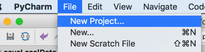
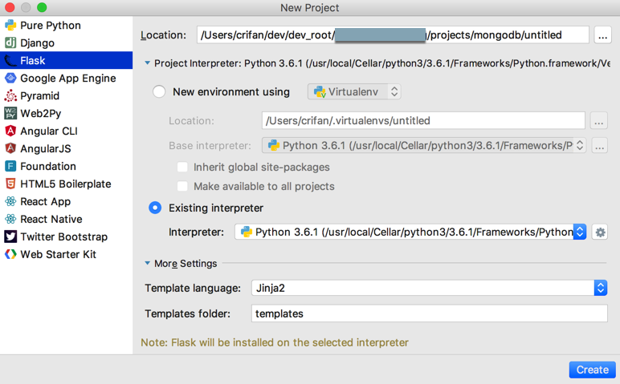
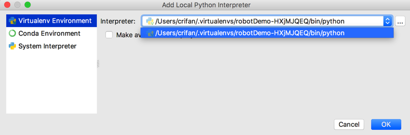
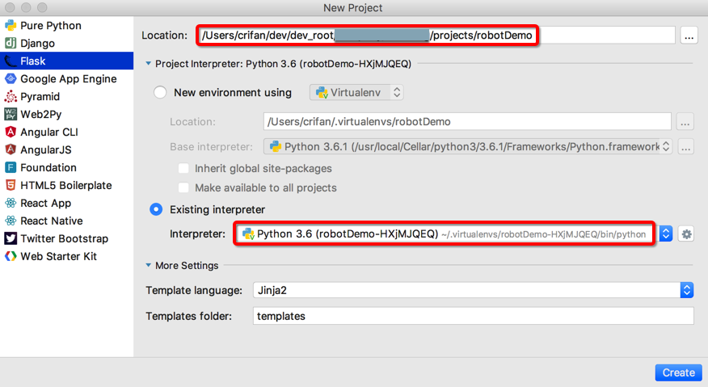
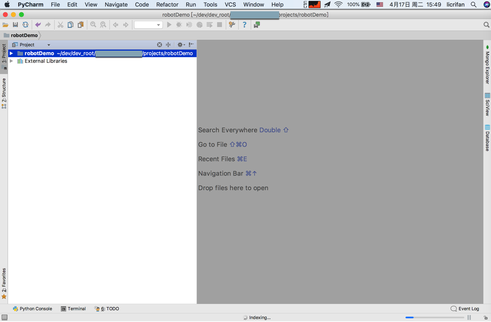
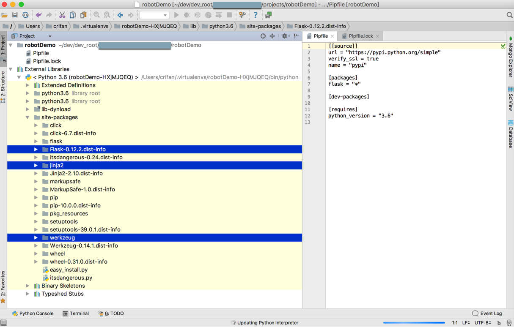
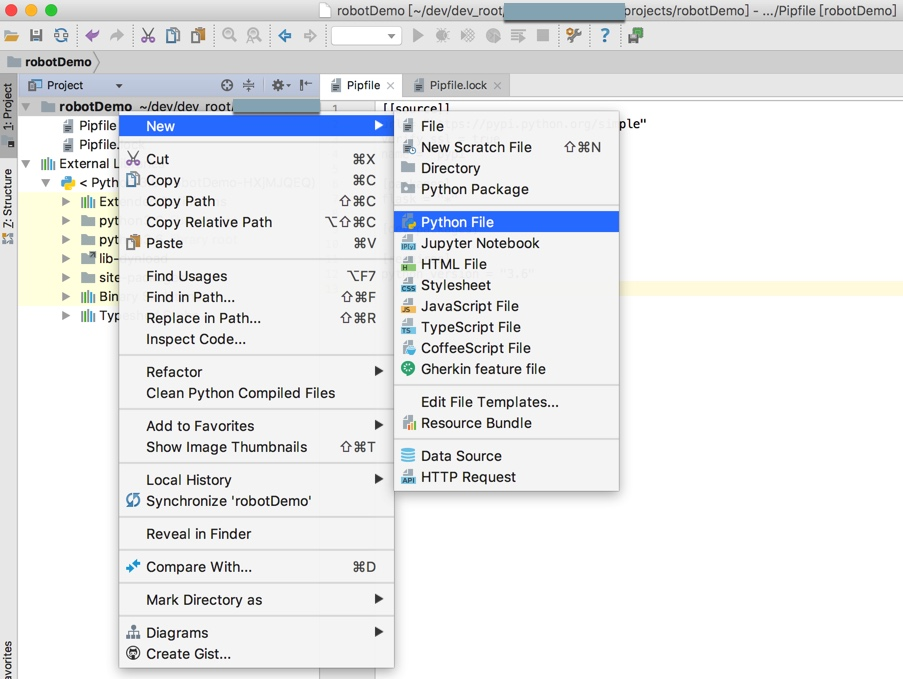
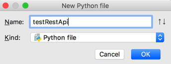
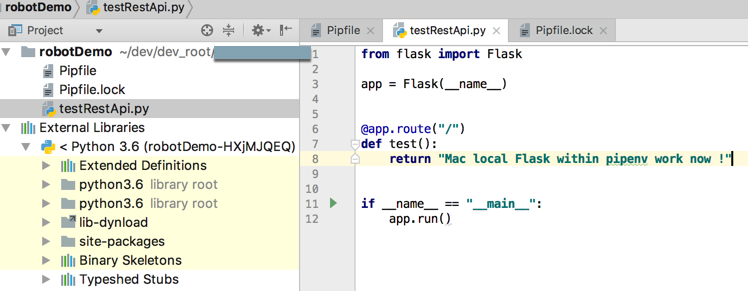

# 新建项目

下面以创建Python的Flask项目为例，来介绍如何用PyCharm新建项目：

`File`->`New Project`

在`New Project`弹框中左边，选择项目是`Flask`的类型

再去确认Python的解释器：

如果已经是你希望的Python，则无需操作；

如果不是，则可以添加对应的Python：点击`Existing interpreter`的配置按钮，点击`All Local`

此处可以看到有提示

`Note: Flask will be installed on the selected interpreter`

意思是：将会自动安装Flask到你所选择的虚拟环境中去。

-》 看来PyCharm针对于虚拟环境支持的很好了。

在弹框中选择对应的Python解释器版本：

确定后，即可看到`Existing interpreter`是刚才所选的Python，以及同时设置好要项目要保存的路径：

点击`Create`即可创建出项目，且底部右下角会显示正在建立索引indexing：

可以看到此虚拟环境中相关的python3的库都可以正常检测到：

然后新建python代码：

输入文件名，点击OK：

即可创建出Python文件：

