# 设置Python版本

新建Python项目后，记得要

* 选择`Python`版本
  * =**设置Python环境**
  * =**设置Python解析器**
  * =**Python虚拟环境**
    * （如果是虚拟环境的话）
* 尤其是
  * 当系统中安装多个版本的Python
    * 既有Python 2
    * 又有Python 3
      * 甚至有多个版本的Python 3
  * 或本身有个Python虚拟环境
    * 比如用`virtualenv`/`pipenv`等创建出来的Python虚拟环境

否则会出现：

* 无法正常调试
  * 找不到已安装的库

下面详细介绍一下，新建Python项目后后，如何设置对应的：

## PyCharm中设置当前项目的Python解析器

新建Python项目（或者打开一个已有Pyhton代码的项目）后，会提示你设置python解析器的：

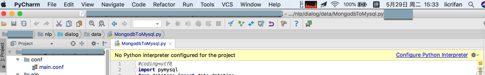

点击后，等价于：

`PyCharm`->`Preferences`->`Project xxx`->`Project Interpreter`

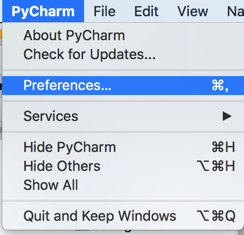

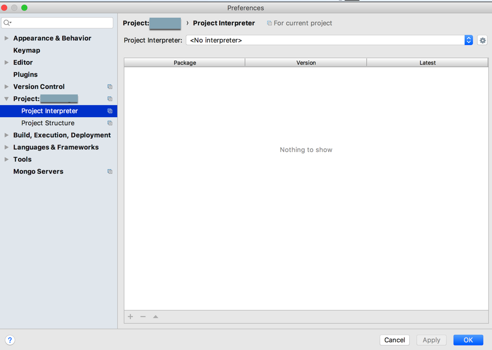

此处，通过`pipenv`添加了虚拟环境后，再去此处设置对应的`python解析器`：

点击`Show All`

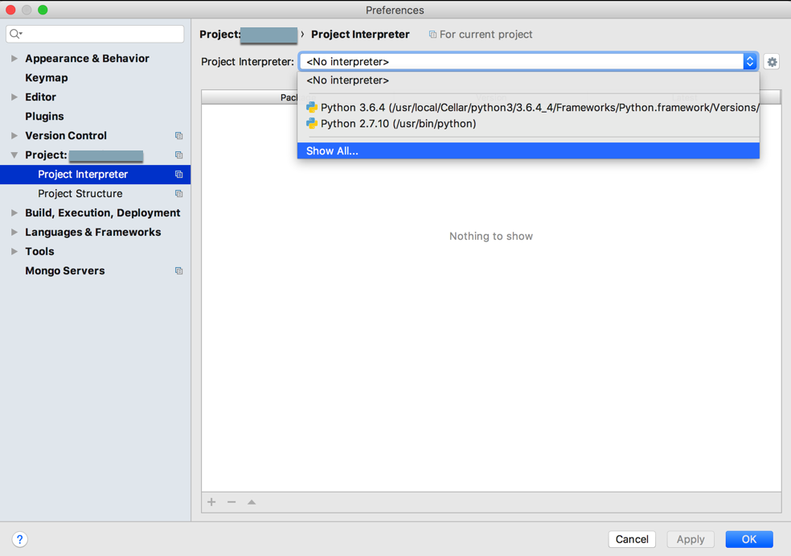

列表中没有刚新建的虚拟环境中的python解析器，所以去`Add local`：

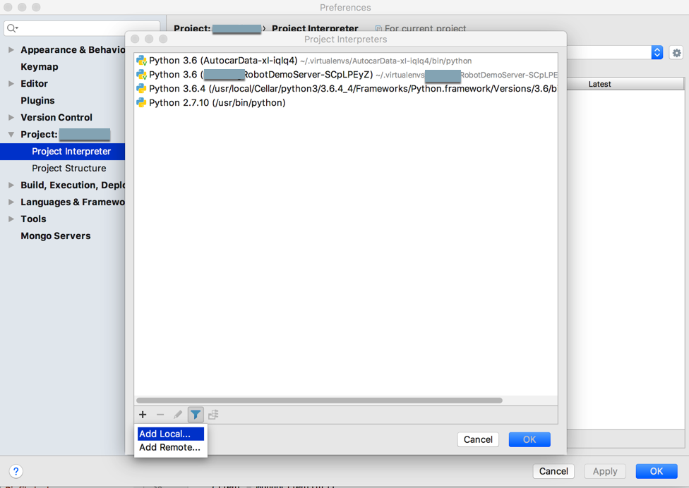

然后发现PyCharm中已经自动帮我们检测到并选择好了：

`Existing environment`中的interpreter，是我们新建的virtualenv中的python解析器：

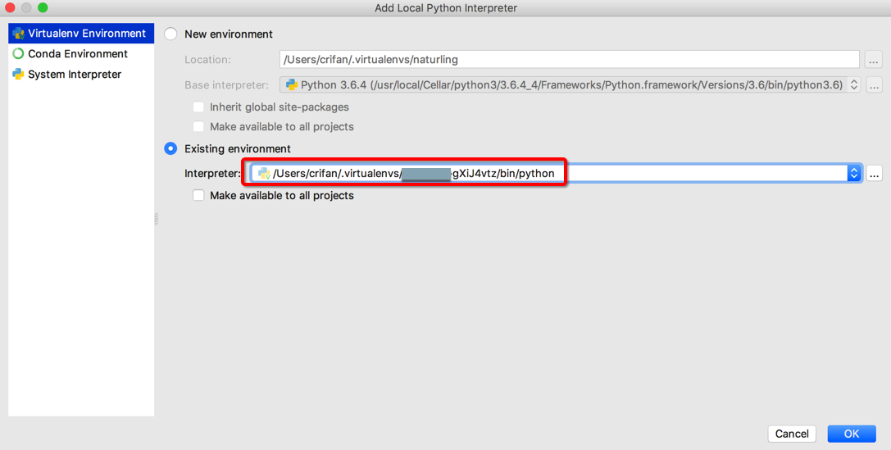

点击列表，还可以看到其他检测出来的虚拟环境的解析器：

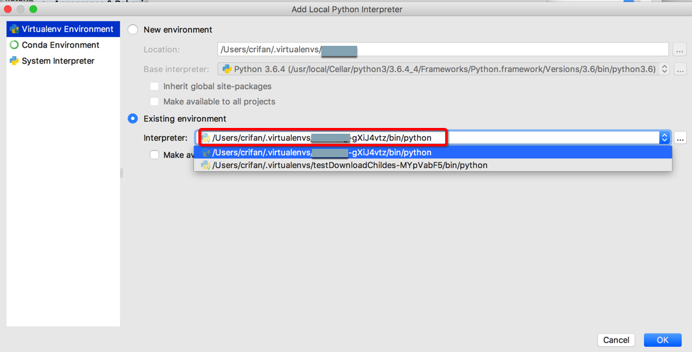

注：如果当前没有识别出你的Python版本，则需要自己手动输入路径去添加。

如果是`Virtualenv`创建的虚拟环境，一般对应的路径都在：

`/Users/YourUserName/.virtualenvs/YourProjectName-F4MCntjh/bin/python`

然后自己去选择：

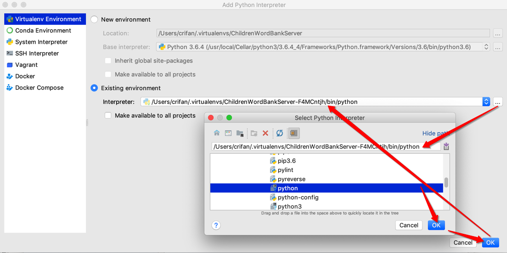

确定后，返回添加页：

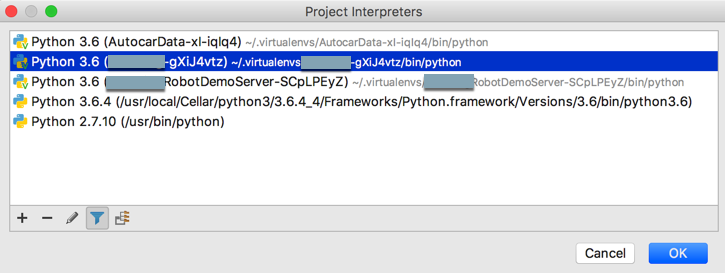

loading后，就可以找到当前python虚拟环境解析器中所安装的库了：

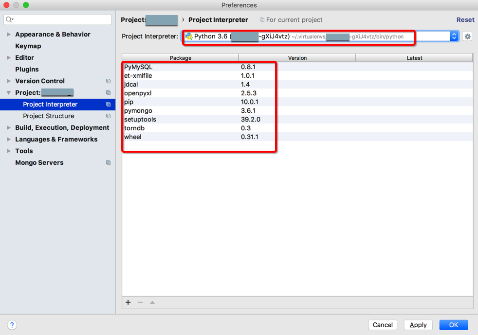

项目底部会显示，有后台任务去：

* 更新python解释器
* 重新建立索引indexing

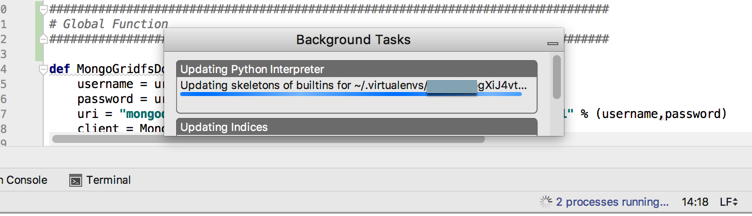

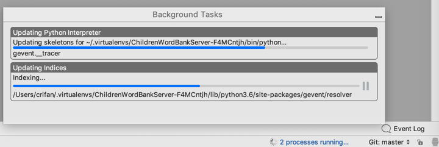

然后就可以在项目左边的文件结构中的`External Libraries`中看到当前Python解析器=当前Python版本，和已安装的相关库了：

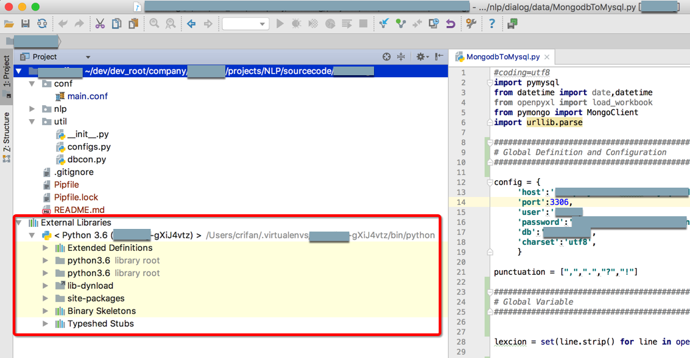
