# 调试项目

创建完毕项目，添加完毕代码后，即可去调试代码。

## 添加调试配置

调试代码前，需要先添加和调试的配置。

### 自动创建调试配置

对于多数情况下，其实可以用PyCharm的智能之处，自动生成调试配置，开始调试。

目前有2种方式：

1. 方式1：直接点击小爬虫一样的`Debug`的按钮：
  * 且鼠标移动上去，会提示`Debug 'xxx' (^D)`
    * 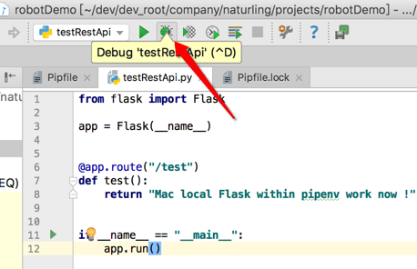
2. 方式2：点击`if __name__ == "__main__"`中的调试选项
   * 对于代码中有：`if __name__ == "__main__"`的情况，PyCharm能自动识别出来，在左边会多出一个绿色按钮，点击后，会出现多个选项：
     * 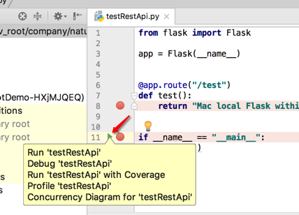
   * 点击其中的 `Debug 'xxx'` 
     * 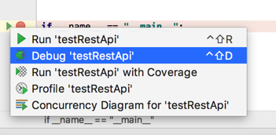

正常情况，即可生成调试配置，开始调试。

### 手动添加调试配置

点击`Run->Edit Configurations`：

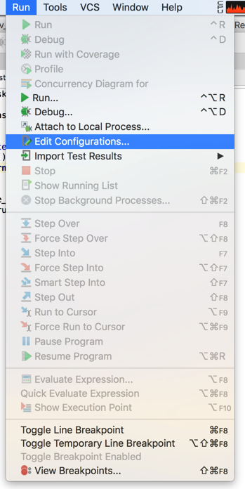

点击`+`创建一个Python的调试配置：

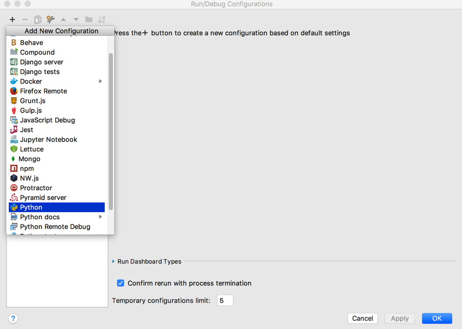

然后输入对应的配置参数：

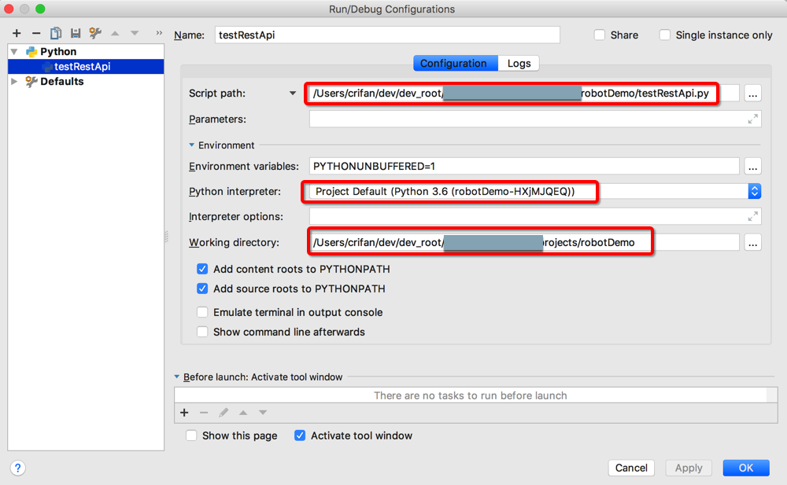

* `Name`：随便设置个名字即可，比如此处的：`testRestApi`
* `Script Path`: `/Users/crifan/dev/xxx/robotDemo/testRestApi.py`
  * 你要调试的Python文件的完整路径
* `Environment variables`: `PYTHONUNBUFFERED=1`
* `Working directory`: `/Users/crifan/dev/xxx/robotDemo`
  * 一般设置为当前项目的根目录
    * PyCharm一般也会自动设置为你`Script Path`的值对应的文件所在的目录的

#### 给Scrapy添加调试配置

对于一些相对特殊的项目，需要搞清楚配置要启动的python文件，和要传入的参数才可以。

比如，Scrapy项目，就是这种，对应调试配置如下：

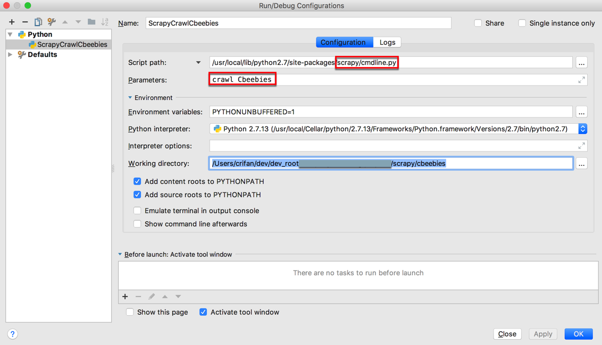

核心参数：

* `Script Path`: `/your_python_version/site-packages/scrapy/cmdline.py`
* `Parameters`: `crawl yourScrapyProjectName`

即可正常启动调试：

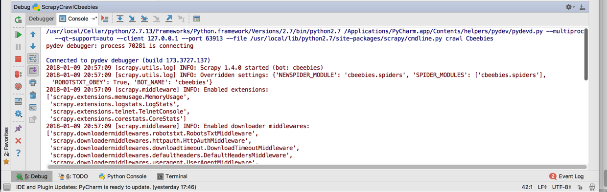

遇到对应断点可以停下来：

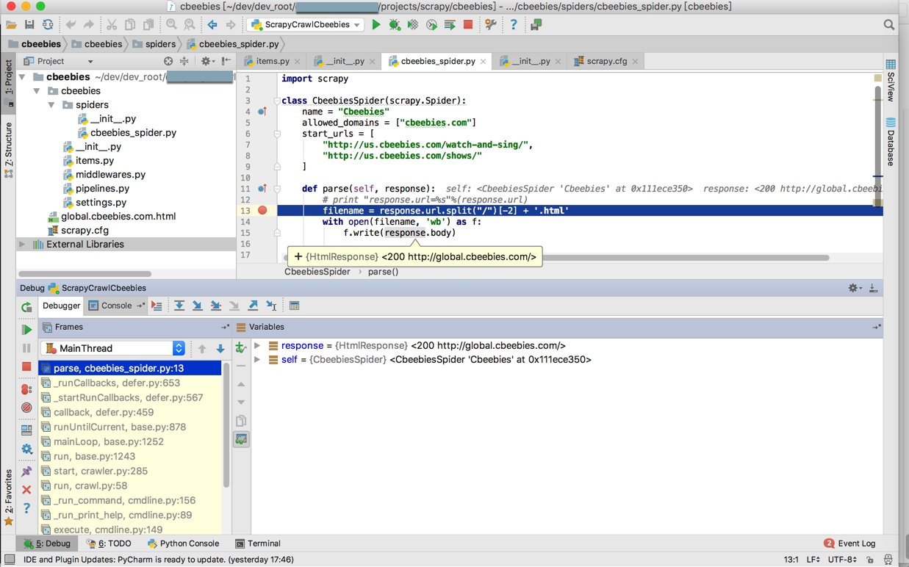

## 调试代码

上述调试配置弄好后，加上断点：

点击每行代码的最左边，行号的左边，即可给该行代码加上断点

然后即可开始调试：

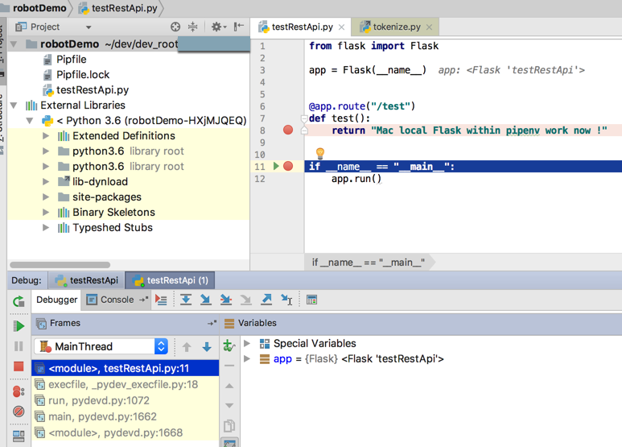

然后单步调试，进入下一行代码：

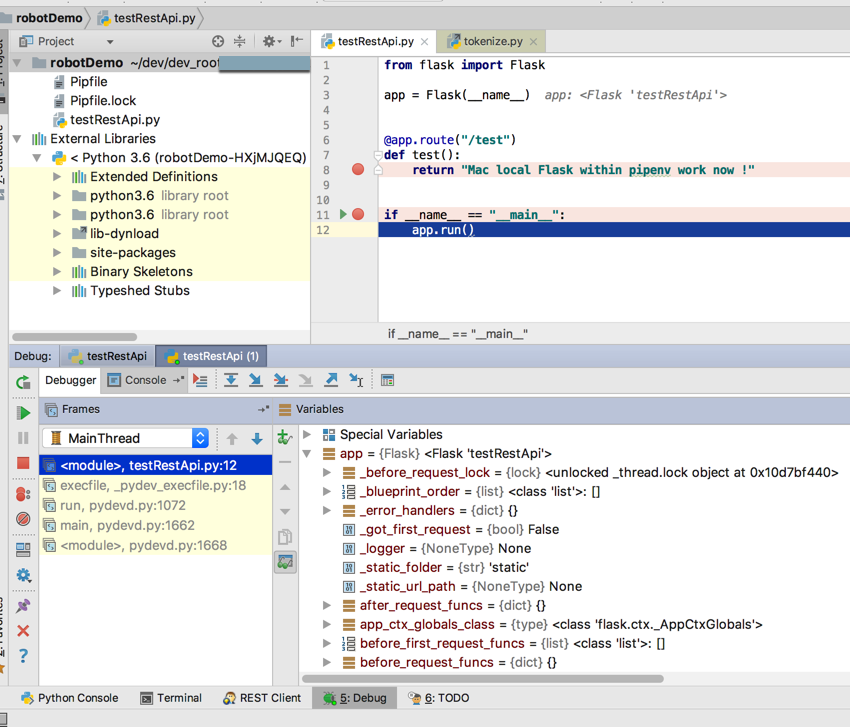

此处Flask的代码即可正常运行：

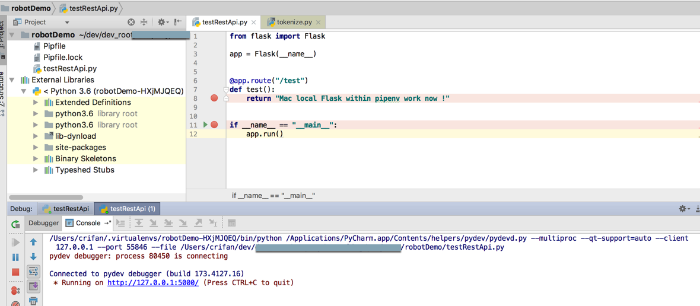
