# 调试心得

在PyCharm调试期间，有些心得和注意事项，整理如下。

## 如果切换调试文件，记得更新Debug配置

背景是，在某个项目中，分别要单独调试某几个Python文件。

当时已经调试完毕其中一个了：

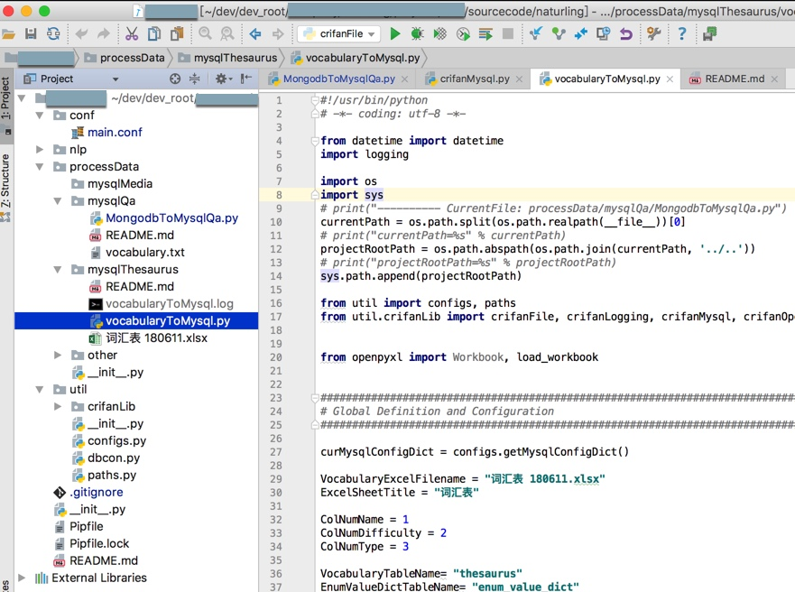

然后切换到另外一个python文件去调试：

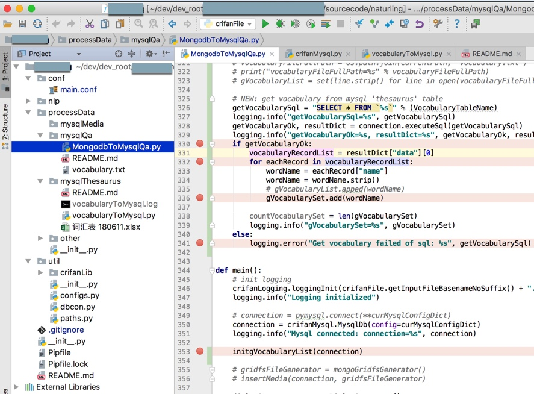

发现遇到很多奇怪的现象：

* log输出也会别的文件的log
* 新文件中的断点也始终无法执行到
* 等等

最后发现原因是：调试的始终是之前的文件，即没有更改调试配置

所以需要去：更新Debug配置

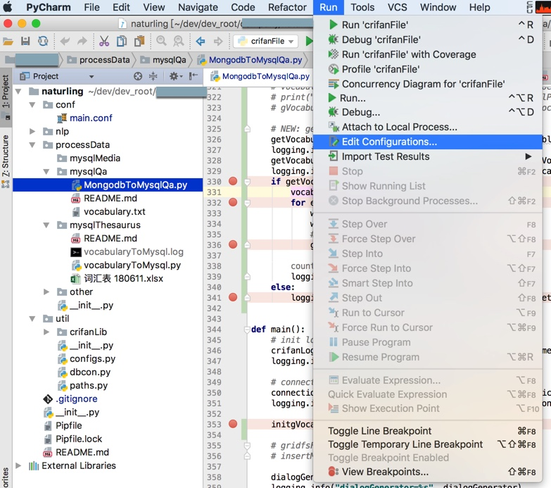

去把之前的要调试的文件：

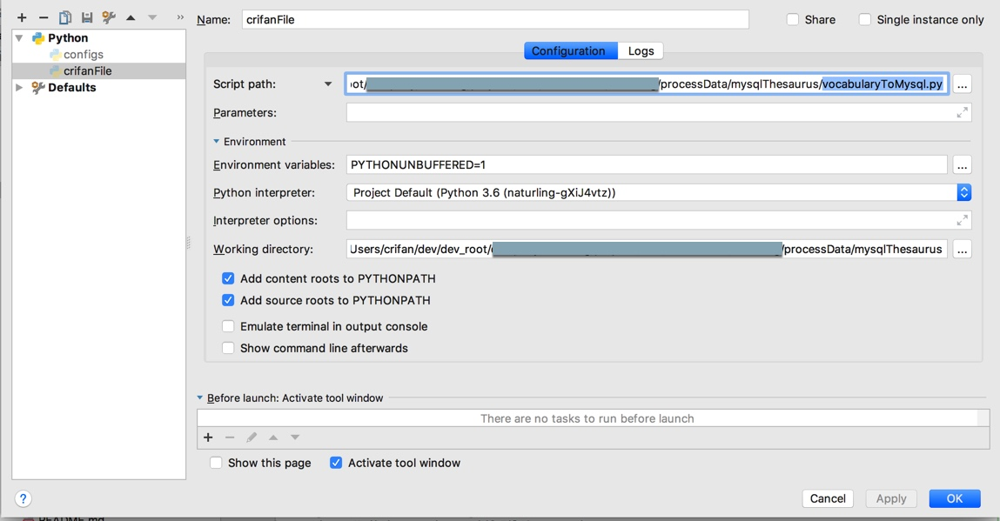

换成当前要调试的新的文件。

可以注意到：不仅要调试的文件名变了，对应当前工作路径，也更新了：

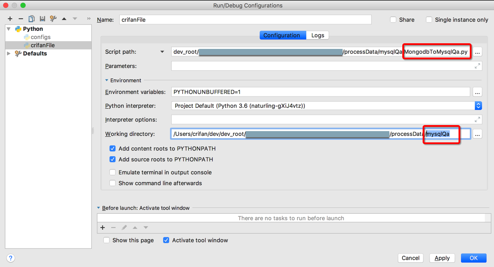

（PyCharm很是智能和方便，考虑的很周到）

然后才能继续调试：

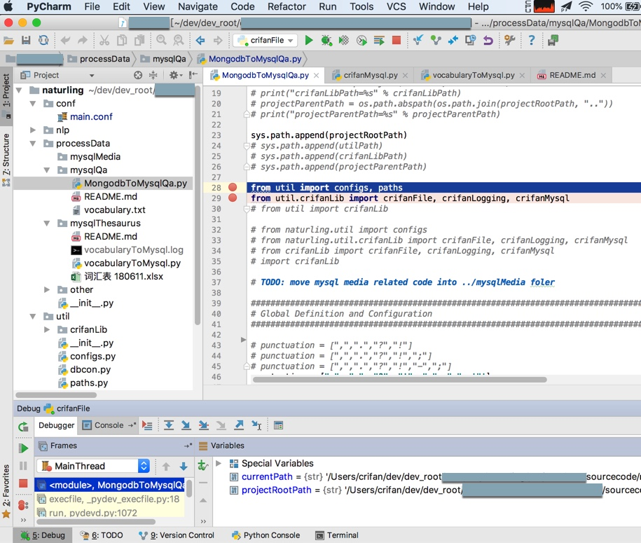

### 举例：没有更新调试导致文件找不到FileNotFoundError

关于文件找不到：

[【已解决】PyCharm中调试pipenv虚拟环境中文件出错：FileNotFoundError Errno 2 No such file or directory pipenv run python py](http://www.crifan.com/pycharm_debug_pipenv_virtualenv_file_filenotfounderror_errno_2_no_such_file_or_directory_pipenv_run_python_py)

后记：

此处的vocabulary.txt和py文件MongodbToMysql.py是在同一个文件夹`nlp/dialog/data/`下面的。

在移动了一次文件后：

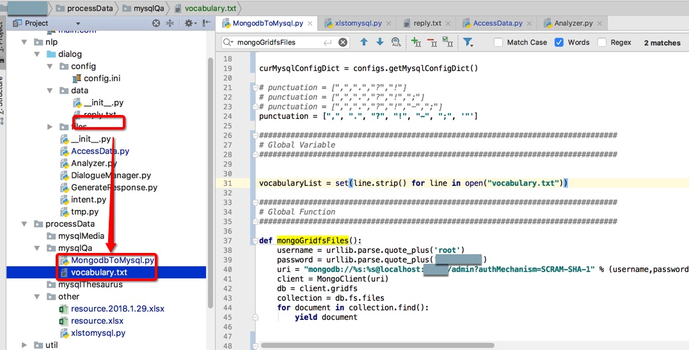

都移动到了另外文件夹`processData/mysqlQa/MongodbToMysql.py`中了。

而之前的Debug调试设置中，是可以正常的执行代码：

```python
vocabularyList = set(line.strip() for line in open("vocabulary.txt"))
```

去打开同文件夹下txt文件的。

但是在移动文件夹之后，再去调试，始终出错：

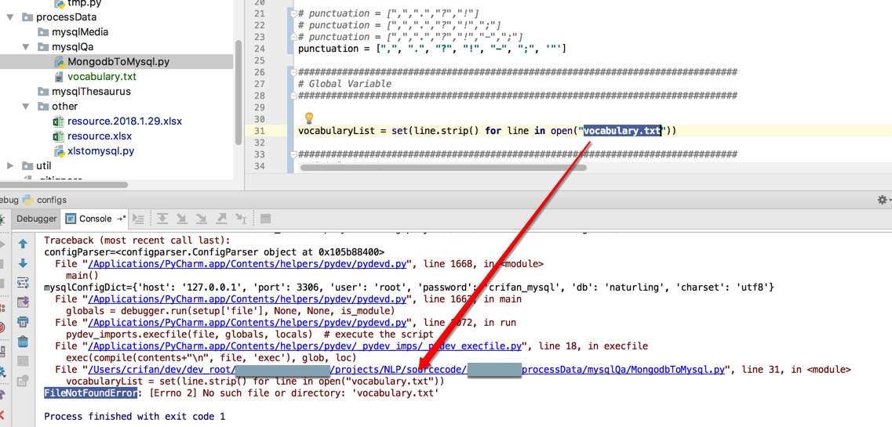

找了找原因，发现是：

在移动文件之后，之前的Debug配置中的当前目录，没有变化，所以去改为py所在的文件夹：

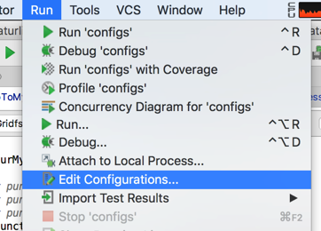

（通过单独选择py文件，自动会设置`Working directory`，或者手动输入，都可以）

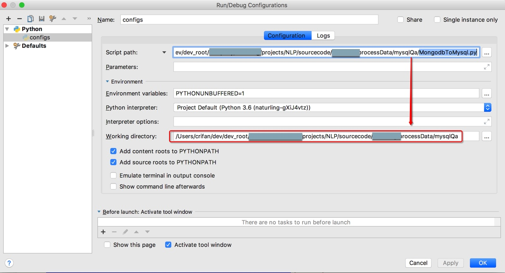

然后就可以解决找不到文件的问题了：

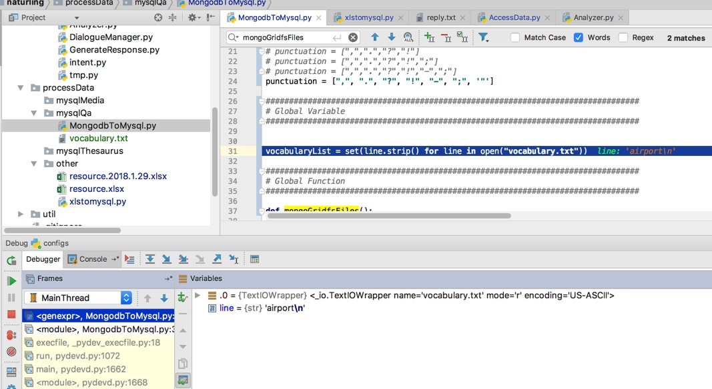
