# 项目部署

开发和调试完毕项目后，会涉及到发布和部署项目代码。

PyCharm对于项目部署、代码上传也有很好的支持。

比如想要把本地调试好的项目代码：

`/Users/crifan/dev/dev_root/company/xxx/xxxRobotDemoServer`

上传到服务器对应位置：

`/yyy_20180101/web/server/robotDemo`

## 添加和配置Deployment参数

先去新增一个`Deployment`配置：

`Tools`->`Deployment`->`Configuration`

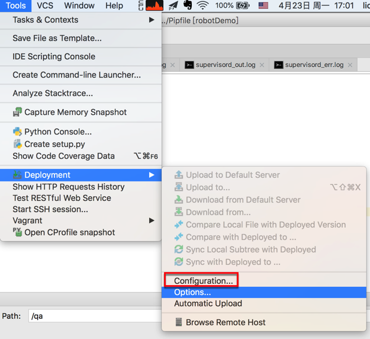

然后点击`+`加号去添加：

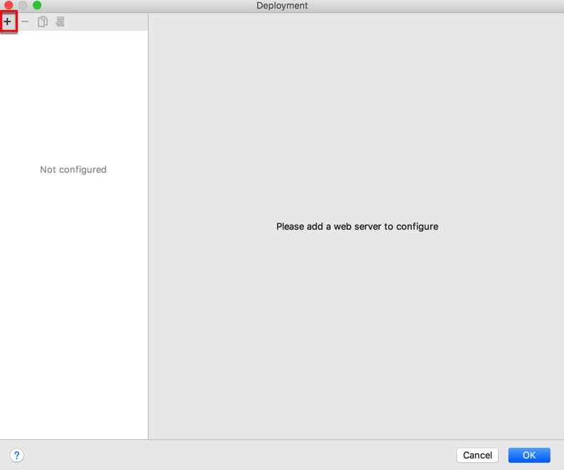

`Add Server`中，输入名字后，选择类型是：`SFTP`

* 说明：此处由于服务器中没有配置FTP服务器，所以用只要支持`SSH`就内置支持的`SFTP`

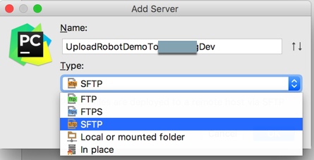

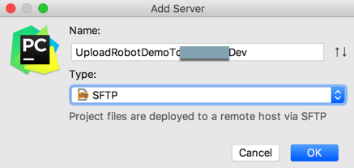

对应的`PyCharm`的Deployment设置是：

* `Connection`
  * 详细配置：
    * `SFTP Host`：`xx.xx.xx.109`
      * 服务器的IP地址
    * `Port`：`22`
      * 默认一般就是`22`
    * `Root Path`：`/root`
      * 选择之前，记得要先去设置好登录方式（**用户名+密码**，还是**用户名+auth**）
      * 注意路径的设置：
        * 可以点击三个点，去选择对应的路径
          * 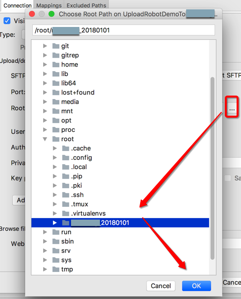
        * 也可以点击`Auto Detect`会自动
          * (默认)设置为当前用户的默认目录
            * 此处用户是root，所以默认路径是：`/root`
    * `User name`：`root`
      * SSH的用户名，一般都是`root`
    * `Auth type`：`Key Pair（OpenSSH or PuTTY）`
      * 密码模式：之前用的多的是，用户名加密码
    * `Private key file`：`/Users/crifan/.ssh/id_rsa`
      * key文件模式：后面别人用了私钥文件，则选择`Key Pair（OpenSSH or Putty）`
        * `Private key file`:选择之前自己创建好的，可以用于SSH登录的rsa的私钥文件
          * 比如此处放在了：`/Users/crifan/.ssh/id_rsa`
  * 如图
    * 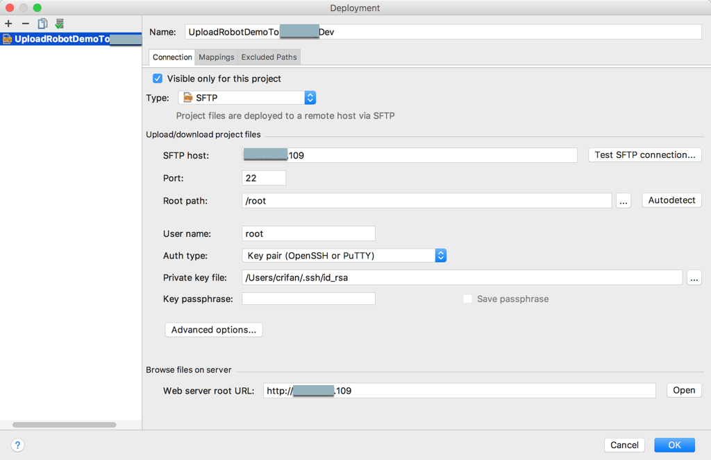
* `Mapping`：
  * 详细配置：
    * `Local Path`：`/Users/crifan/dev/dev_root/company/xxx/xxxRobotDemoServer`
      * 自己本地的目录，写绝对路径，好理解
    * `Deployment Path on server`：`/yyy_20180101/web/server/robotDemo`
      * 注意：此处的路径是相对于`Connection`中的`Root Path`来说的
        * 我此处的`Connection`中的`Root Path`是`/root`
        * 但是此处还是`/`开头的：`/naturling_20180101/web/server/robotDemo`
        * 其实更简单省事的办法是：点击**三个点**，自己选择列出来的路径，即可
    * `Web Path on server`：`/`
  * 如图：
    * 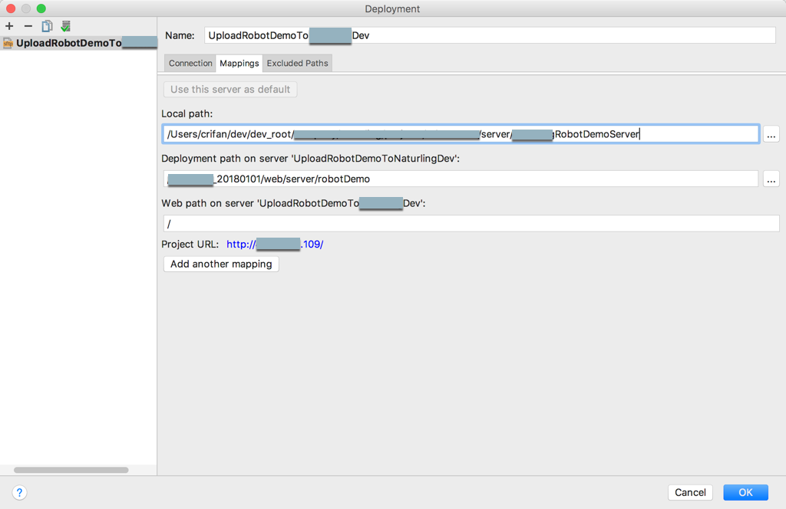
* `Excluded Path`
  * 设置步骤
    * `Add local Path` -》然后输入对应的本地的要排除的路径
      * 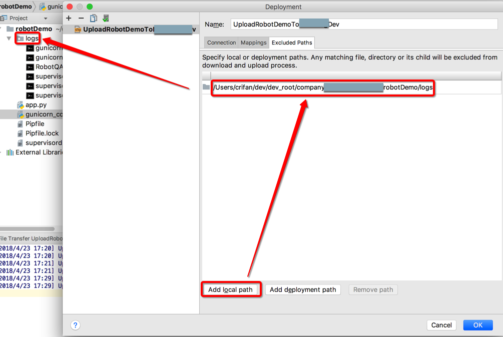
  * 详细配置：
    * `/Users/crifan/dev/dev_root/xxx/xxxRobotDemoServer/tmp`
    * `/Users/crifan/dev/dev_root/xxx/xxxRobotDemoServer/logs`
    * `/Users/crifan/dev/dev_root/xxx/xxxRobotDemoServer/runtime`
  * 如图：
    * 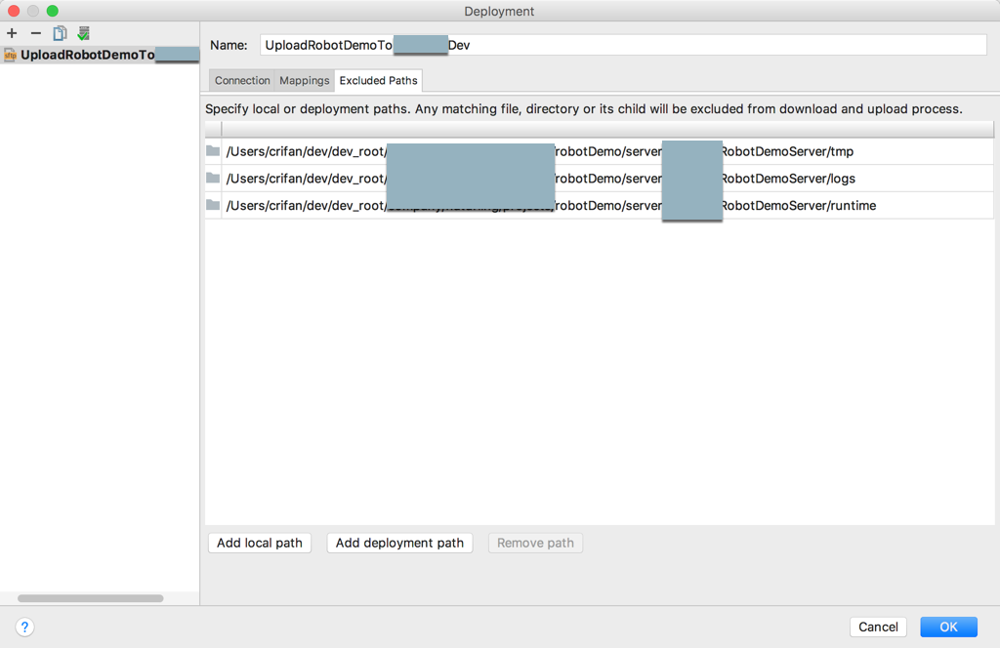

## 如何使用=同步文件到服务器

之后就可以：

* 同步整个项目（有改动的部分)
  * 先点击项目根目录后，再去点击`Tools`->`Deployment`->`Upload to xxx`
    * 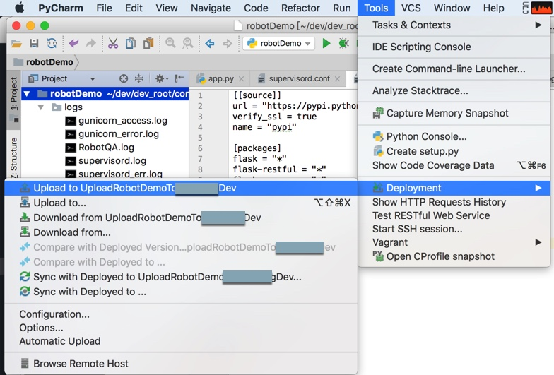
  * 即可上传整个项目的所有文件（去除排除掉的）
    * 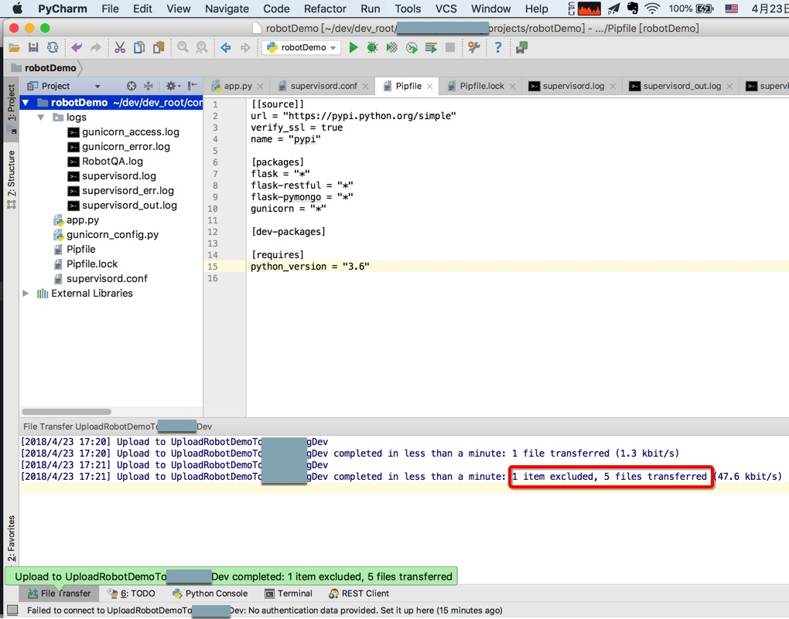
* 同步单个文件
  * 可以（在修改了某单个文件后）**右击**该单个文件，选择`Upload to xxx`，也可以直接单独上传该文件
    * 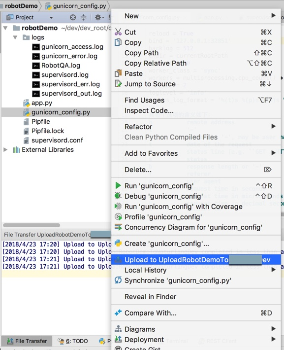
  * 上传后的提示
    * 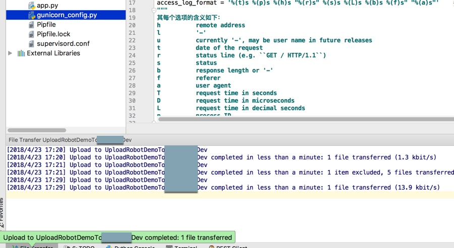
